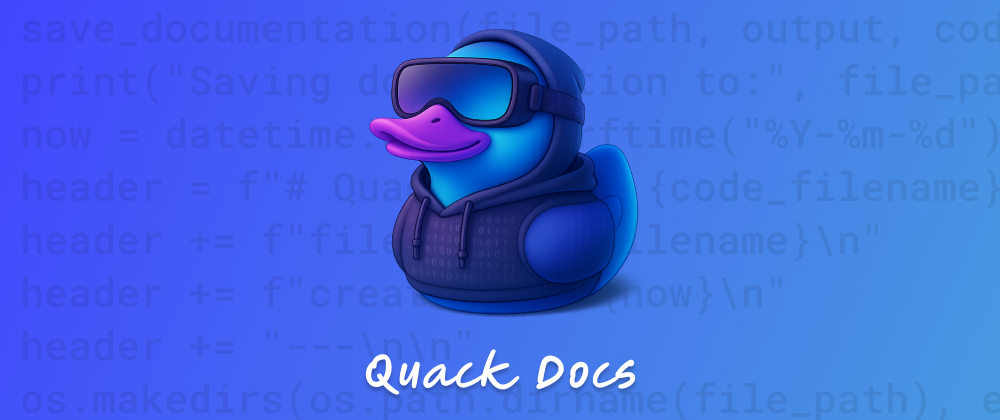

# 🦆 Quack Docs — AI-Powered Code Documentation From Your CLI

*This is a submission for the [Amazon Q Developer "Quack The Code" Challenge](https://dev.to/challenges/aws-amazon-q-v2025-04-30): Crushing the Command Line*

Hey devs! 👋
Introducing **Quack Docs** — a **command-line tool that generates full documentation for your code** using the power of the **Amazon Q Developer CLI**. No chunking, no partials — just clean, complete docs with a single command.

📦 **Source Code**: [GitHub Repository](https://github.com/wesleybertipaglia/quack-docs)
🛠️ **Built With**: Python and  Amazon Q Developer CLI

---

## 📚 Table of Contents

1. [💡 The Idea](#-the-idea)
2. [🤖 How It Works](#-how-it-works)
3. [🚀 Getting Started](#-getting-started)
4. [🧪 Usage](#-usage)
5. [✨ Why You'll Love It](#-why-youll-love-it)
6. [🔭 What’s Next](#-whats-next)
7. [🧠 Final Thoughts](#-final-thoughts)

---

## 💡 The Idea

Let’s be honest: writing documentation isn't most developers’ idea of fun.
So I thought — *what if you could skip the boring part and instantly generate beautiful, structured docs right from your terminal?*

**Quack Docs** was born to solve just that.

### What It Does:

* 📄 Generates Markdown documentation for your code files.
* 🧠 Adds smart, context-aware docstrings directly into your code.
* ⚡ Works with a single command — no chunking or manual editing required.

---

## 🤖 How It Works

Here’s what happens under the hood when you run **Quack Docs**:

1. 📂 **Reads Your Code File**
   The tool reads the entire contents of the provided source file — no splitting or chunking needed.

2. 🧠 **Determines Output Mode**
   It checks whether to:

   * generate an **external Markdown file**, or
   * inject **inline docstrings** (if `--inplace` is used).

3. ✍️ **Builds a Prompt and Sends It to Amazon Q**
   Based on the selected mode, it creates a tailored prompt, sends it to **Amazon Q Developer CLI**, and saves the output — either as a `.md` file or a modified code file with docstrings.

---

## 🚀 Getting Started

### 1️⃣ Clone the Repo

```bash
git clone https://github.com/wesleybertipaglia/quack-docs.git
cd quack-docs
```

### 2️⃣ Install Dependencies

```bash
make install
```

### 3️⃣ Set Up Amazon Q CLI

Follow the [official setup guide](https://docs.aws.amazon.com/amazonq/latest/qdeveloper-ug/command-line-installing.html) and authenticate:

```bash
q login
```

---

## 🧪 Usage

### ▶️ Generate Markdown Documentation

```bash
python main.py --file path/to/your_file.py
```

➡️ Outputs a full `.md` doc to the `docs/` folder.
Example output: `docs/quack_calculator_20250510_103000.md`

#### 📄 Sample Markdown Output:

```markdown
# Quack Docs — calculator.py

file: calculator.py  
created at: 2025-05-10  
---

## Overview
The Calculator class provides basic arithmetic functions and stores the result of the last operation.

## Methods

### add(a, b)
Performs addition of two numbers and stores the result in memory.

Parameters:
• a: First number  
• b: Second number

Returns:
• The sum of the two numbers
```

---

### ▶️ Inject Docstrings into Your Code

```bash
python main.py --file path/to/your_file.py --inplace
```

➡️ Modifies your file in place by adding intelligent docstrings.

#### 📝 Before:

```python
def add(a, b):
    return a + b
```

#### ✅ After:

```python
def add(a, b):
    """
    Add two numbers and return the result.

    Args:
        a: First number
        b: Second number

    Returns:
        The sum of a and b.
    """
    return a + b
```

---

## ✨ Why You'll Love It

**Quack Docs**:

* 🦆 Instantly documents your code with zero hassle
* 📑 Outputs well-structured Markdown or enhances your source files with rich docstrings
* ⚡ Automates a boring task so you can focus on building
* 🎉 Adds a touch of duck-themed joy to your terminal experience

---

## 🔭 What’s Next

Planned improvements include:

* 📊 Documentation coverage stats
* 🧩 VS Code extension
* 🐣 Terminal duck animation while docs generate

---

## 🧠 Final Thoughts

**Quack Docs** is a no-nonsense, fun little tool that helps developers focus on what they love — coding — while **Amazon Q Developer CLI** handles the documentation.

Thanks to AWS and DEV for a fun, productive challenge.

**Let the ducks document. 🦆✨**
